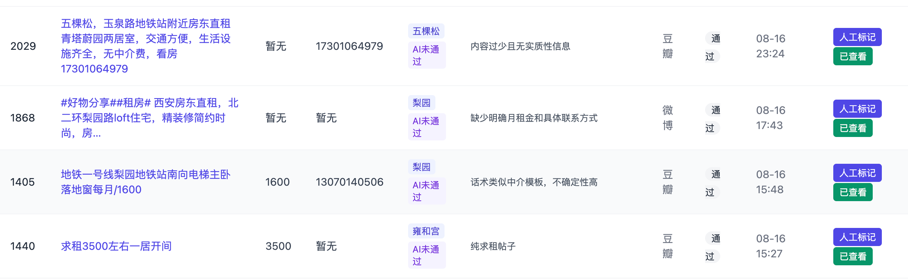
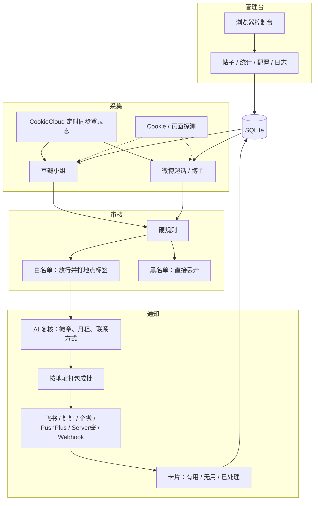

# rent-scout · 租房侦察兵

豆瓣 / 微博租房帖自动采集、筛选、多渠道通知。自托管，数据与配置都在本机 SQLite，浏览器打开控制台即可管理。

仓库：https://github.com/kuankuanlv/rent-scout

> 当前版本：v0.24

## 简介

盯着公开租房讨论区，按设定的小组、超话、博主和时间窗自动采帖。硬规则先挡掉无关帖和中介话术，再交给大模型复核、补月租和联系方式，最后按地址捆成一批推到手机或工作群。有对口房源才响一声。

没有第三方账号体系，也不做中介撮合。改源、改规则、改 Cookie、改通知都在管理台完成，热加载即时生效。

## 功能预览

帖子列表：状态、标签、价格、联系方式，一眼看完。



筛选条件相当丰富，多条件组合快速定位目标房源。


## 系统结构

三条主链路：**采集 → 审核 → 通知**。管理台读写同一份 SQLite，改完配置后各模块热加载。



- **采集**：每个源独立协程，按时间窗轮询。Cookie 可手贴原文，也可交给 CookieCloud 定时把浏览器登录态同步到本地；管理台带探测工具，在线验证 Cookie 好不好使。
- **审核**：白名单命中放行并打地点标签，黑名单命中直接丢。未命中白名单的帖不会进入通知。
- **通知**：推送前走 AI 复核，补月租、联系方式，正文截断后凑批调用以省 token。卡片上能点「有用 / 无用 / 已处理」，群里就能回写控制台。

## 配置介绍

配置全部存在本机 SQLite，没有独立配置文件。Cookie、LLM Key、Webhook 等敏感项也写在同一库里。

启动后会在当前工作目录自动创建：

- `db/`：SQLite 库（默认 `db/rent-scout.db`）
- `logs/`：按日滚动的日志文件

可用环境变量 `DB_PATH`、`LOG_DIR` 改路径。监听地址、日志级别等少数项改完需要重启，其余大多热加载，约十几秒生效。

字段含义、探测按钮和规则编辑都以管理台为准：启动后打开配置页即可。

## 运行

默认监听 `http://localhost:7777`。首次打开会进入 `/admin/setup` 引导：可一键导入内置默认配置（小组、超话、参数已备好，Cookie / Key / Webhook 自己填），或按步骤手动设置。

### 下载 Release（推荐）

适合不打算改代码的使用方。

1. 打开 [Releases](https://github.com/kuankuanlv/rent-scout/releases)，按操作系统和架构下载压缩包。
2. 解压到任意目录，进入该目录后运行：

```bash
# macOS / Linux
chmod +x rent-scout
./rent-scout

# Windows
rent-scout.exe
```

`db/` 和 `logs/` 会出现在运行时的当前目录。macOS 若提示无法打开，到「系统设置 → 隐私与安全性」允许该程序。

### 源码编译运行

需要 [Go 1.25+](https://go.dev/dl/)。

```bash
git clone https://github.com/kuankuanlv/rent-scout.git
cd rent-scout
go run ./cmd/rent-scout
```

或用 Makefile：

```bash
make run          # 编译到 bin/rent-scout 并启动
make build        # 只编译
make test         # 跑测试
```

交叉编译示例：

```bash
GOOS=linux GOARCH=amd64 go build -o rent-scout ./cmd/rent-scout
```

### Docker

```bash
docker compose up -d --build
```

数据目录挂在 `./data`，对应容器内 `/app/db`。浏览器同样打开 http://localhost:7777/admin/setup。
